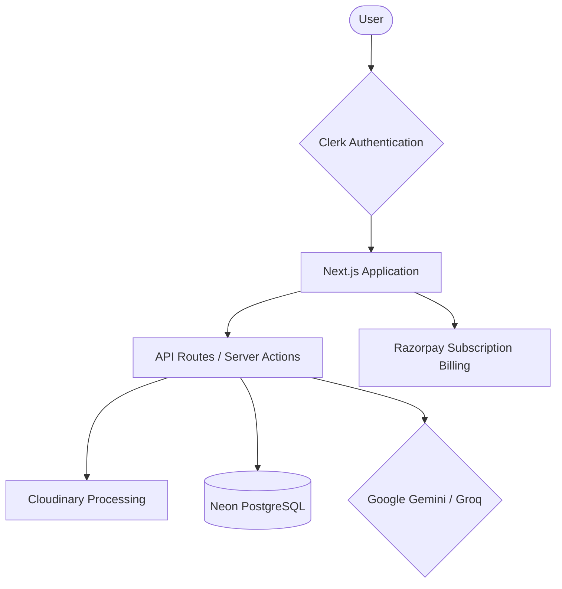

# CreoVue - AI-Powered Creative Suite

## Project Overview
CreoVue is an AI-powered SaaS platform meticulously crafted for creators. It provides an all-in-one suite of tools including AI Smart Crop for multi-platform social media sharing, AI-generated multimodal captions, smart media conversions, and a custom QR Code toolkit. 

## Features
- **Smart Crop**: Upload once and let AI intelligently crop and reframe your content for Instagram, Twitter, and Facebook.
- **AI Captions**: Our multimodal AI analyzes your video/images to generate highly contextual captions and tags.
- **Media Converter**: Seamlessly convert between diverse video and image formats.
- **Video Optimization**: Cloudinary-powered automatic compression, watermarking, and thumbnail generation.
- **QR Toolkit**: Generate and customize high-resolution QR codes mapped to your social links.

## Tech Stack
- **Framework**: Next.js 15 (App Router), React 19, TypeScript
- **Styling**: Tailwind CSS v4, DaisyUI, Framer Motion (via standard classes)
- **Database**: PostgreSQL (Neon DB), Prisma ORM
- **Media Processing**: Cloudinary SDK, local FFmpeg (`@ffmpeg/ffmpeg`)
- **AI Engines**: Google Gemini / Groq Integrations
- **Auth & Payments**: Clerk Authentication, Razorpay
- **Analytics & Observability**: Vercel Analytics, Sentry

## Setup & Installation
1. Clone this repository locally.
2. Run `npm install` to install all necessary dependencies.
3. Configure your environment variables in a root `.env` file (requires API keys for Clerk, Database, Cloudinary, Razorpay, Sentry, and LLM providers).
4. Synchronize the database schema by running `npx prisma db push`.
5. Start the development server with `npm run dev`.

## Architecture Diagram

## Testing
Unit and component testing is set up using **Vitest** and **React Testing Library**.
- To execute tests: `npm test`
